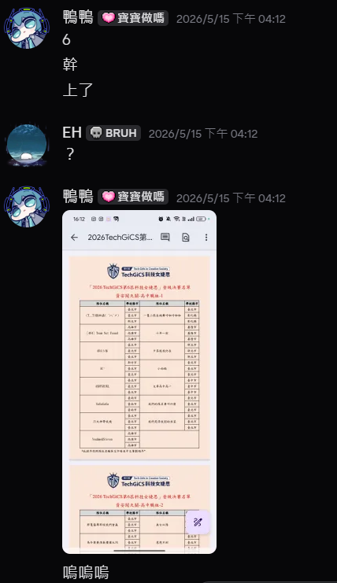

# GiCS2026_writeup
scoreboard: 一隻小熊在跳舞呼啦呼啦啦  
final score: 27250 points  
final place: 2nd  
member: m3tr0, 鴨鴨, 邦邦邦邦   

因為我們只打出四題所以就只寫四題的writeup，   
我也在等官方的解題影片XD   

## 第二題
##### discription: 好問題，我只記得重點是有機密資訊洩漏
##### flag:
`GICS{source_code_leakage_w1th_history}`
解法：git commit leak，總之把githack裝來用無腦翻commit就好  

## 第五題
##### discription: 警衛有在守門但不多，你裝得夠像從AS7539來的就可以拿到flag
##### flag:
`GICS{a_straight_XFF_bypass_br1ng_you_the_flag}`
解法：  
改header，然後隨機在AS7539挑一個幸運IP丟上去  
```
$ curl -H "X-Forwarded-For: 140.110.0.0" 10.100.252.5
access granted from AS7539
GICS{a_straight_XFF_bypass_br1ng_you_the_flag}
```

## 第六題
##### discription:我忘記了:)
##### flag:
`GICS{have_your_he4rd_about_pylingual?}`
解法：.pyc decompiler  
反編譯出來長這樣：  
```
# Decompiled with PyLingual (https://pylingual.io)
# Internal filename: 'challenge.py'
# Bytecode version: 3.14rc3 (3627)
# Source timestamp: 2002-02-20 23:32:15 UTC (1014247935)

import sys
def check(userinput):
    if len(userinput)!= 38:
        return False
    else:
        passed = 0
        if userinput[1] == 'I':
            passed += 1
        if userinput[0] == 'G':
            passed += 1
        if userinput[7] == 'v':
            passed += 1
        if userinput[23] == 'o':
            passed += 1
        if userinput[14] == '_':
            passed += 1
        if userinput[37] == '}':
            passed += 1
        if userinput[5] == 'h':
            passed += 1
        if userinput[12] == 'u':
            passed += 1
        if userinput[29] == 'l':
            passed += 1
        if userinput[3] == 'S':
            passed += 1
        if userinput[18] == 'r':
            passed += 1
        if userinput[34] == 'a':
            passed += 1
        if userinput[9] == '_':
            passed += 1
        if userinput[25] == 't':
            passed += 1
        if userinput[31] == 'n':
            passed += 1
        if userinput[16] == 'e':
            passed += 1
        if userinput[21] == 'a':
            passed += 1
        if userinput[6] == 'a':
            passed += 1
        if userinput[36] == '?':
            passed += 1
        if userinput[11] == 'o':
            passed += 1
        if userinput[27] == 'p':
            passed += 1
        if userinput[2] == 'C':
            passed += 1
        if userinput[33] == 'u':
            passed += 1
        if userinput[15] == 'h':
            passed += 1
        if userinput[20] == '_':
            passed += 1
        if userinput[8] == 'e':
            passed += 1
        if userinput[30] == 'i':
            passed += 1
        if userinput[4] == '{':
            passed += 1
        if userinput[24] == 'u':
            passed += 1
        if userinput[13] == 'r':
            passed += 1
        if userinput[35] == 'l':
            passed += 1
        if userinput[10] == 'y':
            passed += 1
        if userinput[28] == 'y':
            passed += 1
        if userinput[17] == '4':
            passed += 1
        if userinput[22] == 'b':
            passed += 1
        if userinput[19] == 'd':
            passed += 1
        if userinput[32] == 'g':
            passed += 1
        if userinput[26] == '_':
            passed += 1
        return passed == 38
def main():
    sys.stdout.write('flag> ')
    sys.stdout.flush()
    userinput = sys.stdin.readline().strip()
    if check(userinput):
        print('Correct!')
        return 0
    else:
        print('Nope.')
        return 1
if __name__ == '__main__':
    raise SystemExit(main())
```
~~據說鴨鴨有問邦邦這要怎麼復原，然後邦邦叫他土法煉鋼，快笑死，反正是拿到flag了~~

## 第十題
##### discription:總之就是RSA，然後題目直接說小明覺得n, e, c洩漏沒差
##### flag:
`GICS{factoring_N_looks_easy_w1th_quantum_computers}`
解法：
先去分解網站分解出p, q，剩下就寫腳本
```
#!/usr/bin/python3
from Crypto.Util.number import *

n = 114381625757888867669235779976146612010218296721242362562561842935706935245733897830597123563958705058989075147599290026879543541
p = 3490529510847650949147849619903898133417764638493387843990820577
q = 32769132993266709549961988190834461413177642967992942539798288533
e = 65537
c = 55046376776916185289397767275594417226002578184122508956231325805285021888626046914339208205941392368250956083486920215538293264

phi = (q - 1) * (p - 1)
d = inverse(e , phi)

print(long_to_bytes(pow(c , d , n)))
```
出來就是flag了，甜甜的分數好棒

## 心得
### 找隊友跟老師作業
我們這組都是第一次打，我的話是2025.4入坑，  
結果完美錯過上一屆女婕思。
然後我認識有在打資安的女生都已經有隊伍了，同屆跟資研的人也沒有要跟我一起打的意思QQ，~~我又不會因為沒得名吃人雖然我是資研社長聽起來有點可怕~~，  
於是~~失去了力氣與手段的我選擇鬼轉Threads找隊友~~，  
最後運氣很好地遇到了鴨跟邦，  
一個讓我在SITCON遲到沒飯吃的時候拿北電的便當去吃；一個初賽打完後在我看AP325的時候教我競程。  
當然，除了兩位隊友還有很nice的指導老師飛翔，~~讓我刷下去OSCP跟被監督坐牢進度~~，不過最感謝的還是飛翔提供了很多資安的競賽跟培訓資訊。  
### 初賽賽前準備
我做了蠻多功課比如研究怎麼打跟什麼時候用道具，  
總之就是**不要跟別人打起來、要打別人土地的話記得用水槍跟水球，土地形狀盡量不要太細長，往圓了打，用怪獸蛋當牆把自己圍好圍滿。**  
然後總賽程103小時，反正一隻帳號先打完是絕對不現實的做法，所以就先開一兩隻打這樣。  
詳細一點長這樣：  
```
先拿一隻帳號打200題，花費1200~1650點能量 (可以控制在1300內最好，1650是底線(答錯50題))，至少要2.5~3天=60~72hrs，總賽程103hrs。
也就是我們如果想要把200*3題全打完，一定要在第一隻帳號打完第二天的能量前把第二、三隻開起來答題。
答題時可以開兩個視窗一個登第一隻帳號，一個登其他隻，方便在答題時看第一隻的答題記錄。
用道具似乎不會有加分，我的構想是一直往外打，但碰到別人領土就先打到空一格海洋&用道具防邊界。打的土地就盡量平均是圓形這樣
如果到時候真的四周都打完了都碰到別人領土了，選一個跟我們接觸最少領土&土地細長的打，這樣他想打我們領土必須一個一個打 
Btw, 我覺得應該不用特地去花答題數升土地，道具就很夠了
```
不過我初賽鬼迷心竅失敗了，我們把底下那隊圍到剩有旗的主領地&在六塊土地圍了2層蛋，  
我們那個時候多開心之後就多難過www。  
### 初賽D1
我們看到同隊的地是相鄰的，所以果斷選擇先連起來蓋堤防。  
連完後我們把心思動到底下那一隊，把他們打到剩一塊地&圍好圍滿，~~在通話笑得合不攏嘴覺得自己很詐。~~  
### 初賽D2
隔天下午我們發現底下那隊活起來反毆我們，~~很迷的是他還把那12顆蛋打完才反攻我們，不過我看到的時候已經太晚了沒辦法把他們打掉。~~  
然後鴨跟邦就先把他們圍的那兩隻打掉重生，就我一個跟別人扭打w，  
而且我在看被我圍的那隻帳號打題目，他打完一題我就餵一次營養劑回土地血，結果發現他答錯一大堆浪費我營養劑ToT？  
不過我們晚上連麥打題目的時候犯了一堆很好笑的錯，那天晚上加起來大概就錯了十題。  
### 初賽D3
這天我們就還是正常打，不過我們又錯了4題，總錯題數來到了14題，~~已經開始準備聽天由命了，而且底下還是有打過來的趨勢。~~
### 初賽D4 (最後一天)
這天因為是下午5.完賽，我又要補習，所以就選擇早上11.打完我們所有題數。  
最後預估分數是5278分，剛打完的時候是第9名。  
雖然爬前五屆幾乎5000就可以去決賽玩，但這次因為有強大的LLM，所以我們覺得超懸，~~還跑去用望遠鏡網站占卜我們會不會進決賽。~~  
如果你很好奇我們算出來的結果是什麼，我的算出來是穩進；邦邦的算出來是有困難。  
~~結果我在補習的時候開平台來看，發現我土地被打了14塊啊啊啊，心態炸裂，從13名看到隊伍掉出15名，已經在DC群說明年見了。~~  
*最後我們是18名，5250分
### 5/15 晉級決賽名單出來
因為那天我們中午就放學了，所以我是在跟朋友吃壽司郎時收到消息的。  

6，取了30隊，雖然進決賽很爽但這代表我們決賽對手比簡章寫的多了15隊。  
邦邦的反應：耶公假！但我們完全忘記決賽是星期六，超級好笑  
### 決賽前準備
因為學姐說他們之前是提早下去住一晚，所以我決定效仿w，拉了鴨鴨跟邦邦先下去台南住。  
但因為要訂住宿時高鐵台南站附近的都沒了，所以我們是住台南火車站附近的嵐茵。  
### 決賽前一天
我本來跟鴨邦說我會做簡報然後在旅館激情開講，結果我被統聯搞到整整比我預想的晚了一小時到，  
所以我們放完東西出去分食了一碗大碗牛肉湯就回旅館洗洗睡，全隊都快1.才睡，我已經有拿參加獎的準備了XD。  
### 決賽當天賽前
進去的時候還真的覺得挺壯觀的，而且碰到超多老熟人，然後發現好多人都穿制服和運動服w  
賽前就是一直跑去社交，然後看到學姐開HackMD準備共編，~~學起來~~  
它有給kali工具機的IP，我本來只想用ssh連，結果開賽後發現不單純:(
### 第一階段開賽
開賽快一小時我們這隊還是連不上靶機，我怎麼nc都連不上，還跑去填表單請工作人員來處理，結果工作人員叫我好好看題目  
然後我還是連不上靶機，我當時的想法只有：哭啊比賽還沒開始就要結束了炸裂，結果邦邦說他連不上題目但可以幹出原始碼，然後貼了一個curl指令給我。  
~~女婕思官方請問這也是題目的一環嗎？~~  
過了不久鴨鴨就說他看到題目了，最後發現是一定要用工具機開才能看到題目的介面，所以就用RDP連了。  
題目分配是我從底下打上來，鴨邦先打1、2題。  
而且不知道為什麼我的pip install都抓不到套件，害我在打RSA那題的時候很躁，腳本都寫完了但根本沒辦法運作，找了一大堆online python，都沒安裝cryptodome，超級難過。不過最後我突然想到colab，就拿到9000分了:)  
之後就是大坐牢，我reverse沒有ida活不下去，還裝不了ida，objdump是要看什麼>:(  
然後鴨鴨跟邦邦也坐牢了兩三個小時，問我可不可以開提示，我：先冷靜，我看一下題目！！  
與此同時記分板也剛好關掉，我們好像是在第五名。
第一題我很天真以為這就改magic num而已，~~誰通靈得出來還有XOR，哭啊~~，然後我就叫鴨鴨不要開提示先去打別題了。  
第二題看到機密資訊洩漏就大概猜到是robots.txt之類的東西了，看了一下/.git發現確實w，載了githack翻commit就拿到4000分了。  
之後就是一直坐牢，然後我的頭腦不知道為什麼開始很混亂，大概有半小時在亂戳也戳不出所以然。  
然後鴨鴨就突然說：欸我們又有9000分了，打出bytecode那題了，~~我開心到跑到他旁邊跳來跳去~~  
最後距離關題目剩8分鐘，我們就把提示全開了，~~我還是覺得很哭我用burpsuite一直在看網段那題的response，忘記看送的request有哪些東西~~  
反正很驚險地在最後一分鐘拿到內部網段那題的flag&送出去，又拿到了5250分，總分27250分。  
### 第二階段開賽
我本來以為這次也是動手實作之類的把每隊丟出去十分鐘解題，結果大家還是要在原地坐牢50分鐘打第二階段的兩題，破大房。  
我們根本連題目都看不懂哈哈哈，一直以為是要prompt injection那個AI，結果那個AI好像真的是幫助我們解題的，我們要打的是那個系統wwwww  
但當我們開完提示掃完nmap的時候只剩一分鐘了，掃完看到九千多port有開也無力回天，最後是一題沒拿破大房，超焦慮  
### 頒獎
15:50頒獎，我們15:30就被叫去坐在觀眾席了w，~~那個音樂動感到我緊張的心也開始超級動感，真是謝了~~。 
我以為他們會從佳作開始一路報上去，結果是直接從前三名開始報，然後就看到學姐跟Grasping兩組上去了，超電  
然後我又開始很焦慮w，因為接下來就剩二跟一了。
### 第二名
他要頒第二名的時候我就跟邦邦說我好緊張好害怕，  
結果看到切簡報後我們的隊名出現在上面：沃喔喔喔喔喔喔喔喔！！！！！啊啊啊啊啊！！！！！  
~~我根本一路跑上去，超爽，我愛我的家人朋友隊友跟指導老師~~  
  

### 後記
我後來有把第二名的板子帶回家，在高鐵上超顯眼然後我媽騎摩托車來接我，~~一路感受到超大風阻，不過板子最後是成功回我家了哈哈~~
### 真的心得
我本來以為我只是來玩的，結果不小心打了個第二，我愛我的隊友們。